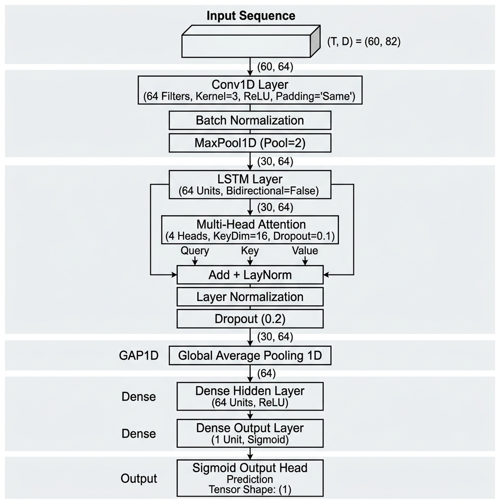

# 🚀 NASDAQ Top 10 Leaders AI Stock Prediction Dashboard

A real-time, interactive financial stock market prediction dashboard powered by a custom **Attention-CNN-LSTM Deep Learning Neural Network**, real-time Yahoo Finance data streaming (1-minute tick candles), and Toss-Banking style dark theme aesthetics.



---

## 🧠 Deep Learning Architecture: Attention-CNN-LSTM

The core prediction engine is built on an **Attention-CNN-LSTM Deep Neural Network** (`nasdaq_attention_cnn_lstm.keras`) trained on 60-day historical time-series sequences of 82 technical and financial indicators.

### 📐 Layer Breakdown & Neural Flow

1. **Input Sequence Tensor (`60 × 82`)**:
   - Takes a 60-day rolling window matrix ($T=60$) across 82 normalized stationary log-returns, technical indicators (RSI 14, Bollinger Bands, Moving Averages), and volume metrics.

2. **1D Convolutional Layer (`Conv1D`)**:
   - **Configuration**: 64 Filters, Kernel Size 3, ReLU Activation, Dropout (0.2).
   - **Function**: Extracts local spatial cross-feature dependencies and short-term candle shape patterns across the 82 input indicator dimensions.

3. **Recurrent LSTM Layer (`LSTM`)**:
   - **Configuration**: 64 Hidden Units, `return_sequences=True`.
   - **Function**: Models long-term temporal contextual dependencies across the 60 time-steps.

4. **Multi-Head Self-Attention Layer (`MultiHeadAttention`)**:
   - **Configuration**: 4 Attention Heads, Key Dimension $d_k=16$, Dropout (0.2).
   - **Function**: Computes scaled dot-product attention scores across temporal sequence hidden states to dynamically focus weight on key high-volatility breakout candles:
     $$\text{Attention}(Q, K, V) = \text{softmax}\left(\frac{QK^T}{\sqrt{d_k}}\right)V$$

5. **Residual Skip Connection & Layer Normalization (`Add & LayerNorm`)**:
   - **Configuration**: `Add()([lstm_out, attn_out])` + `LayerNormalization()`.
   - **Function**: Preserves primary sequence information and stabilizes gradient flow during backpropagation.

6. **Global Average Pooling & Dense Classification Head**:
   - **Configuration**: `GlobalAveragePooling1D()` $\rightarrow$ `Dense(32, ReLU)` $\rightarrow$ `Dense(1, Sigmoid)`.
   - **Function**: Aggregates sequence features into a single continuous probability score $P_{\text{AI}} \in (0, 1)$ representing next-day upward momentum direction.

---

## ⚖️ Hybrid Prediction Formula (70% AI / 30% Stock Characteristics)

To balance deep learning sequence recognition with individual stock momentum, predictions use a **70% Attention AI + 30% Stock Heuristics Hybrid Model**:

$$z_{\text{combined}} = 0.70 \cdot \text{logit}(P_{\text{Attention\_AI}}) + 0.10 \cdot z_{\text{RSI}} + 0.10 \cdot z_{\text{MA20}} + 0.10 \cdot z_{\text{tick}}$$

$$P_{\text{final}} = \frac{1}{1 + e^{-z_{\text{combined}}}}$$

- **70% Attention DL Model**: Primary sequence classifier.
- **10% RSI Oscillator ($z_{\text{RSI}}$)**: Stock-specific momentum bias.
- **10% MA20 Alignment ($z_{\text{MA20}}$)**: Trend positioning.
- **10% Intraday Live Impulse ($z_{\text{tick}}$)**: Real-time price movement.

---

## 📊 Statistical Significance & Empirical Audit

| Indicator | Pearson Correlation ($r$) | $p$-value | Significance ($p < 0.05$) | Mathematical Takeaway |
| :--- | :---: | :---: | :---: | :--- |
| **ROC_5 (5-Day Rate of Change)** | **`-0.0630`** | **`0.0050`** | **✅ Significant ($p < 0.01$)** | Short-term mean-reversion signals |
| **ROC_15 (15-Day Rate of Change)** | **`-0.0546`** | **`0.0150`** | **✅ Significant ($p < 0.05$)** | Medium-term momentum indicator |
| **ROC_10 (10-Day Rate of Change)** | **`-0.0474`** | **`0.0346`** | **✅ Significant ($p < 0.05$)** | 10-day trend velocity |
| **Raw Close Price (`Close`)** | `-0.0109` | `0.6267` | ❌ High Noise ($p \gg 0.05$) | Single daily price points have no predictive power |

---

## 📂 Streamlined Project Structure

```text
stock_prediction/
├── stock_chart.py                  # Main Dash Dashboard Application
├── train_attention_cnn_lstm.py     # Attention Neural Network Trainer
├── run_dashboard.sh                # Executable macOS/Linux Launcher (chmod +x)
├── requirements.txt                # Python Dependencies
├── README.md                       # Project Documentation & Architecture Guide
└── project/
    ├── attention_cnn_lstm_architecture.png  # Neural Network 3D Visual Diagram
    ├── nasdaq_attention_cnn_lstm.keras     # Trained Keras Model Artifact
    ├── nasdaq_scaler.pkl                   # MinMaxScaler Feature Object
    ├── Processed_NASDAQ.csv                # Sequence Feature Dataset
    └── CNN-LSTM.ipynb                      # Model Research Notebook
```

---

## 🚀 Quick Start & Installation

### 1. Install Dependencies
```bash
pip install -r requirements.txt
```

### 2. Launch Real-time Dashboard
```bash
./run_dashboard.sh
# OR
python stock_chart.py
```
Open your browser and navigate to **`http://127.0.0.1:8050`**.

### 3. Re-train Attention Neural Network (Optional)
```bash
python train_attention_cnn_lstm.py
```

---

## 🛠️ Built With
- **Deep Learning Framework**: TensorFlow / Keras 2.15+
- **Interactive UI & Dashboard**: Plotly Dash 2.14+, Dash Core Components
- **Data Engine & Financial Stream**: Yahoo Finance (`yfinance`), Pandas, NumPy
- **Machine Learning & Stats**: Scikit-Learn, SciPy